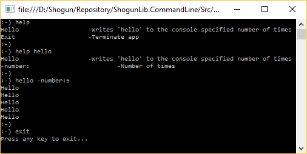

# ShogunLib.CommandLine

[](https://ci.appveyor.com/project/iivchenko/shogunlib-commandline)

Micro command line framework. Develop fast, enjoy results! 



```csharp
const string HelloCommand = "Hello";           
const string ExitCommand = "Exit";

const string NumberParameter = "-number:";

var builder = InterpreterBuilderFactory.Create();

// Setup builder
builder
	.SetHelp("Help",
			 (sender, args) =>
				 {
					 if (args.Commands.Count == 1)
					 {
						 var command = args.Commands.First();

						 Console.WriteLine("{0}\t\t\t-{1}", command.Name, command.Description);

						 foreach (var parameter in command.Parameters)
						 {
							 Console.WriteLine("{0}\t\t\t-{1}", parameter.Name, parameter.Description);
						 }
					 }
					 else
					 {
						 foreach (var command in args.Commands)
						 {
							 Console.WriteLine("{0}\t\t\t-{1}", command.Name, command.Description);
						 }
					 }
				 });

// Add Commands
builder
	.Add(HelloCommand)               
	.Add(ExitCommand);

// Setup commands
builder[HelloCommand]
	.SetDescription("Writes 'hello' to the console specified number of times")
	.SetAction(arguments =>
				   {
					   var times = arguments[NumberParameter].Any()
									   ? int.Parse(arguments[NumberParameter].First(),
												   CultureInfo.InvariantCulture)
									   : 0;

					   for (var i = 0; i < times; i++)
					   {
						   Console.WriteLine("Hello");
					   }
				   });

builder[ExitCommand]
	.SetDescription("Terminate app")
	.SetAction(arguments =>
				   {
					   isContinue = false;
					   Console.WriteLine("Press any key to exit...");
				   });

// Add parameters
builder[HelloCommand].Add(NumberParameter);

// Setup parameters
builder[HelloCommand][NumberParameter]
	.SetDescription("Number of times")
	.AddValidator(new OptionalParameterValidator())
	.AddValidator(new IntTypeValidator());

// Building interpreter
return builder.Create();
```

## Releases ##
<BLANK>

## License ##

ShogunLib.CommandLine is open source software, licensed under the terms of MIT license. 
See [LICENSE](LICENSE) for details.